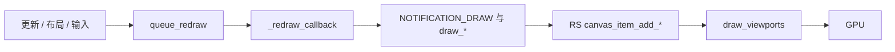

# Godot GUI：继承关系与渲染流程

面向本仓库源码阅读的笔记：**控件类谁继承谁**、**一帧里怎么画到屏幕上**。

---

## 文档导读

| 区块 | 内容 |
|------|------|
| [一句话结论](#一句话结论) | 先建立整体印象 |
| [类继承](#类继承) | `Control` 与 `Window` 两条线 + 树形列表 |
| [渲染流水线](#渲染流水线) | 从 `queue_redraw` 到 GPU |
| [Button 示例](#button-示例) | 主题 → `NOTIFICATION_DRAW` → RS 命令 |
| [源码索引](#源码索引) | 该先打开哪些文件 |
| [附录](#附录) | `tick()`、`FUNCn`、维护说明 |

---

## 一句话结论

- **控件**都是 `Control` → 也是 `CanvasItem`，在 `RenderingServer` 里各有一个 **`canvas_item` RID**。
- **画画**不是在场景里造「绘制子节点」，而是：需要时 **`queue_redraw`** → 清空/重填 **这一条 `canvas_item` 上的 RS 命令** → 视口绘制阶段执行。
- **窗口**（`Window` / 弹窗）继承 **`Viewport`**，不是 `Control`；窗口里的界面仍是底下的 **`Control` 子树**。

---

## 类继承

### 主干（必读）

两棵在 `Node` 下分叉的树：

**控件线**

```
Object → Node → CanvasItem → Control
```

**窗口线**

```
Object → Node → Viewport → Window →（Popup / AcceptDialog …）
```

---

### Control → 容器（Container）

`split_container.h`：**SplitContainerDragger**、**SplitContainerMultiDragger** 直接继承 `Control`，用作分割条热点，**不是** `Container`。

```
Control
└── Container
    ├── BoxContainer
    │   ├── HBoxContainer
    │   └── VBoxContainer
    ├── GridContainer
    ├── FlowContainer
    │   ├── HFlowContainer
    │   └── VFlowContainer
    ├── CenterContainer
    ├── MarginContainer
    ├── AspectRatioContainer
    ├── SplitContainer
    │   ├── HSplitContainer
    │   └── VSplitContainer
    ├── ScrollContainer
    ├── PanelContainer
    ├── SubViewportContainer
    ├── TabContainer
    ├── FoldableContainer
    └── GraphElement
        ├── GraphNode
        └── GraphFrame
```

---

### Control → 按钮（BaseButton）

```
Control
└── BaseButton
    ├── Button
    │   ├── CheckButton
    │   ├── MenuButton
    │   ├── OptionButton
    │   └── ColorPickerButton   ← color_picker.h
    ├── TextureButton
    ├── LinkButton
    └── ColorPresetButton
```

---

### Control → 数值与进度（Range）

```
Control
└── Range
    ├── SpinBox
    ├── Slider
    │   ├── HSlider
    │   └── VSlider
    ├── ScrollBar
    │   ├── HScrollBar
    │   └── VScrollBar
    ├── ProgressBar
    └── TextureProgressBar
```

---

### Control → 文本与编辑

```
Control
├── Label
├── LineEdit
│   └── SpinBoxLineEdit
├── TextEdit
│   └── CodeEdit
└── RichTextLabel
```

---

### 其它直接继承 Control 的常见类

声明均在对应 `scene/gui/*.h`（`class X : public Control`）。

- **简单块**：`Panel`，`ColorRect`，`TextureRect`，`NinePatchRect`，`ReferenceRect`
- **列表/树**：`TabBar`，`ItemList`，`Tree`
- **分隔**：`Separator` → `HSeparator`，`VSeparator`
- **其它**：`MenuBar`，`VideoStreamPlayer`，`VirtualJoystick`，`GraphEdit`，`GraphEditFilter`，`GraphEditMinimap`

---

### 窗口与对话框（不继承 Control）

```
Node
└── Viewport
    └── Window
        ├── Popup
        │   ├── PopupPanel
        │   └── PopupMenu
        └── AcceptDialog
            └── ConfirmationDialog
                └── FileDialog
```

---

### 常被误认为控件、但不是 Control

| 类型 | 父类 | 说明 |
|------|------|------|
| `TreeItem` | `Object` | 数据行，不是场景里的 `Control` |
| `ButtonGroup`，`FoldableGroup` | `Resource` | 逻辑分组 |
| `ColorPickerShape*` | `Object` | 颜色盘几何 |
| `ViewPanner` | `RefCounted` | 平移辅助 |

---

## 渲染流水线

### 总体顺序（5 步）

```
① 进树 / 布局 / 输入  … 需要刷新外观 → queue_redraw()
② 帧末 deferred：CanvasItem::_redraw_callback()
      · 可选 canvas_item_clear
      · NOTIFICATION_DRAW → （draw 信号 / _draw）
      · draw_*、StyleBox::draw 等 → 写入 canvas_item_add_*
③ Control::NOTIFICATION_DRAW 里设 clip、custom_rect 等
④ 主渲染：RenderingServerDefault::_draw → draw_viewports
⑤ GPU：合成到窗口或 RenderTarget
```

### 各步对应源码（查代码时按表跳转）

| 步骤 | 文件 | 函数 / 说明 |
|------|------|-------------|
| 挂到 2D 画布 | `scene/main/canvas_item.cpp` | `_enter_canvas()`：`canvas_item_set_parent`，`queue_redraw` |
| 推迟到安全时机重画 | 同文件 | `queue_redraw()` → deferred `_redraw_callback` |
| 真正执行绘制回调 | 同文件 | `_redraw_callback()`：`canvas_item_clear`、`NOTIFICATION_DRAW`、`draw`、`_draw` |
| 控件层公共设置 | `scene/gui/control.cpp` | `NOTIFICATION_DRAW`：`canvas_item_set_clip` 等 |
| 提交整帧视口 | `servers/rendering/rendering_server_default.cpp` | `_draw` → `RSG::viewport->draw_viewports()` |

### 绘制在数据层是什么

- 每个 `CanvasItem` 对应 RS 里 **一批顺序执行的 draw 命令**（线、矩形、纹理、文字网格等）。
- 子类（例如 `Button`）在 `NOTIFICATION_DRAW` 里调用的高层 API，最终会走到 **`canvas_item_add_*`**，由 `RendererCanvasCull` 等记录；再在 `RendererViewport::draw_viewports` 路径里跑 GPU。

### FUNCn 宏（为何随便线程都能调 RS）

- `rendering_server_default.h` 里 `FUNC6(canvas_item_add_line, …)` 等由 `servers/server_wrap_mt_common.h` 展开。
- **非**渲染 server 线程：调用进 **`command_queue`**；**是** server 线程：`flush_if_pending` 后直接调 **`RSG::canvas`**（`RendererCanvasCull`）。
- **`WRITE_ACTION`**：这里是 `redraw_request()`，用于统计/调试。

### 与 GUI 无关的一点：`RenderingServer::tick()`

- `RenderingServerDefault::tick()` → `RSG::canvas->tick()` / `scene->tick()`，服务于**物理插值**等。
- **只有** `SceneTree::iteration_prepare()` 且 **`physics_interpolation` 开启** 时才会调（见 `scene/main/scene_tree.cpp`）。
- **默认**工程里常关插值，**不会**每物理帧跑这个 `tick()`；**不等于** GUI 不重画。GUI 重画靠 **`queue_redraw` + 视口绘制**。

---

## Button 示例

把抽象流程落到具体类：

1. **主题** — `BIND_THEME_ITEM` 把 `theme_cache` 绑到 `Theme` 的 Button 资源；`NOTIFICATION_THEME_CHANGED` 时刷新。
2. **状态** — `BaseButton::get_draw_mode()` 决定用哪套 `StyleBox`、字体色、图标色。
3. **画** — `button.cpp` 的 `NOTIFICATION_DRAW`：  
   - 背景：`style->draw(ci, …)`（非 flat）  
   - 焦点：`theme_cache.focus->draw`  
   - 图标：`draw_texture_rect`  
   - 文字：`text_buf->draw` / `draw_outline`
4. **StyleBox** — 例如 `StyleBoxFlat::draw` 再拆成多次对同一 `canvas_item` 的 RS 调用。

**结论**：没有单独的「绘制子对象链表」；每次重画是 **（必要时 clear 后）重建这一条 item 的命令序列**。

---

## 源码索引

按学习顺序建议：

1. `scene/main/canvas_item.cpp` — `queue_redraw`、`_redraw_callback`
2. `scene/gui/control.cpp` — `NOTIFICATION_DRAW` 与裁剪
3. `scene/gui/container.cpp` — `NOTIFICATION_SORT_CHILDREN` 与布局
4. `scene/gui/button.cpp`、`base_button.cpp` — 主题与状态机
5. `servers/rendering/rendering_server_default.h`、`servers/server_wrap_mt_common.h` — 线程封装
6. `servers/rendering/renderer_canvas_cull.cpp` — 2D 命令侧
7. `servers/rendering/renderer_viewport.cpp` — `draw_viewports`

---

## 附录

### 维护说明

- 类名以 **`scene/gui/*.h`** 及 **`scene/main/window.h`、`viewport.h`、`canvas_item.h`** 为准，版本升级可能增减类。
- 本文不写具体渲染后端（Forward+ / Mobile / Compatibility）差异；GUI 关注的是 **Canvas Item 命令 → Viewport 绘制** 的共性路径。

### 可选：主流程 Mermaid（需支持 Mermaid 的阅读器）

若你的 Markdown 预览支持图表，下面与上文「5 步」等价：



---

*路径：`doc/dev/GUI_INHERITANCE_AND_RENDERING.md`*
